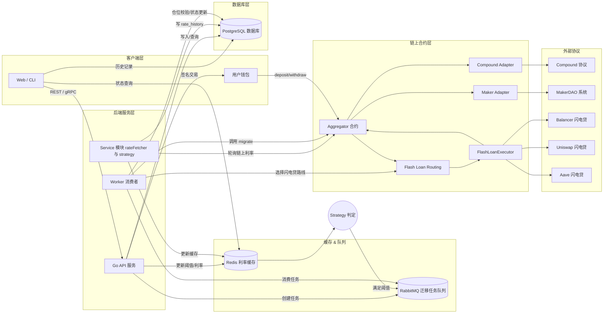
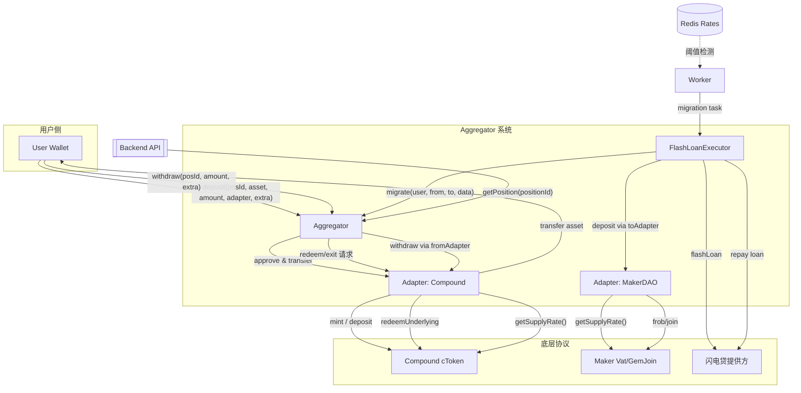

# 合约接口说明（Lending Aggregator）

> 适用于后端服务、脚本工具或前端在与链上聚合器交互时快速查阅。接口均基于 Solidity 0.8.24，兼容 Foundry `abigen` 生成的 Go 绑定。
>
> 更多背景与伪代码请参阅 `docs/lending-aggregator-tutorial.md`，目录布局参考 `docs/project-structure.md`。

---

## 0. 快速上手

### 0.1 依赖清单
- Foundry (`forge`/`cast`) ≥ 1.0：编译、测试、部署智能合约。
- Node.js 18+ 与 pnpm/yarn：运行前端脚手架或链下脚本。
- Go 1.21+：生成 `abigen` 绑定、编写后台服务。
- Docker / docker-compose（可选）：快速启动 Redis、PostgreSQL、RabbitMQ。
- 一个可签名账户（EOA 或 Gnosis Safe），用于部署与治理操作。

### 0.2 部署与初始化流程
1. `forge build` 确认合约编译无误；根据目标网络准备 `.env` 与部署脚本。
2. 部署 `Aggregator` 合约并记录地址；部署 `FlashLoanExecutor`，构造函数写入 Aggregator 地址。
3. 调用 `Aggregator.setAdapter(adapter, true)` 注册至少一个 Adapter；必要时在 Adapter 端设置底层协议授权。
4. 更新治理权限：`transferOwnership` 给多签 → 多签执行 `setFlashExecutor`、`setAdapter` 等初始化操作。
5. 链下初始化：迁移数据库 schema、配置 Redis 阈值、启动 Worker 并写入 `flashExecutor` 与 Adapter 地址表。

### 0.3 合约最小调用序列
```solidity
IAggregator aggregator = IAggregator(0x...);
address adapter = 0x...;
address collateralAsset = 0x...;
bytes32 positionId = aggregator.derivePositionId(user, collateralAsset, adapter, salt);

IAggregator.DepositExtra memory extra = IAggregator.DepositExtra({
  permit: bytes(""),
  minShares: 0,
  adapterParams: bytes("")
});

aggregator.deposit(
  positionId,
  collateralAsset,
  amount,
  adapter,
  abi.encode(extra)
);

IAggregator.Position memory pos = aggregator.getPosition(positionId);

aggregator.withdraw(positionId, redeemAmount, bytes(""));
```

### 0.4 链下 Worker 工作流
- 监听 `Deposited`、`Borrowed`、`Migrated` 事件，实时同步 PostgreSQL 仓位与债务表。
- 定时抓取各 Adapter 的供需利率并写入 Redis，触发策略判定（阈值满足则投递迁移任务到 RabbitMQ）。
- 收到迁移任务后，组合 `MigrationParams`，向闪电贷提供方发起调用，并在回调中执行 `FlashLoanExecutor.executeMigration`。
- 迁移完成后重新抓取链上仓位快照，与 Redis 缓存对账。

### 0.5 常见踩坑
- 忽略 `setAdapter` 或权限配置，导致 Aggregator 调用时 `adapter not allowed`。
- `flashExecutor` 地址未更新即触发迁移，`migrate` 将直接 revert。
- `MigrationParams` 中的数组顺序应满足“先清算旧仓位后构建新仓位”，与实际 Adapter 执行顺序保持一致。
- Foundry fork 测试需要预先为多签/Worker 地址注入足够的 Token 与 ETH；否则 approve、还款会失败。

## 1. 平台架构总览



---

## 2. Aggregator (`IAggregator`)

中央托管合约，负责用户资金管理、协议适配器调用及仓位迁移。

### 2.1 数据结构

```solidity
struct Position {
  bytes32 id;
  address owner;
  address collateralAsset;
  address adapter;
  uint256 collateralAmount;
  address debtAsset;
  uint256 debtAmount;
  uint256 lastHealthFactor; // Ray precision (1e27), 0 when未借贷
}
```

- `id`：仓位唯一标识，建议计算方式为 `keccak256(abi.encode(owner, collateralAsset, adapter, salt))`，便于多策略/多适配器共存。
- `owner`：仓位所属用户地址，可为多签钱包或智能账户。
- `collateralAsset`：抵押资产地址；与 `collateralAmount` 一起描述存入仓位的资产。
- `adapter`：对应的协议适配器地址。
- `collateralAmount`：当前抵押数量，单位为 token 原生精度。
- `debtAsset`：借出资产地址，未借贷时为零地址。
- `debtAmount`：未偿还借款的本金（或当前债务余额），单位为 token 原生精度。
- `lastHealthFactor`：最近一次从协议读取的健康度（Ray 精度，1e27）；未借贷时可设为 0，借贷操作后应刷新。

### 2.2 事件

| 事件 | 参数 | 描述 |
|------|------|------|
| `Deposited(bytes32 indexed positionId, address indexed user, address indexed adapter, uint256 amount, bytes extra)` | `positionId` 仓位标识；`extra` 为 Adapter 自定义参数 | 存款成功触发，后端可据此更新仓位表。 |
| `Withdrawn(bytes32 indexed positionId, address indexed user, address indexed adapter, uint256 amount, bytes extra)` | 同上 | 赎回完成。 |
| `Migrated(bytes32 indexed positionId, address indexed user, address fromAdapter, address toAdapter, bytes data)` | `data` 描述迁移细节 | 仓位迁移完成。 |
| `Borrowed(bytes32 indexed positionId, address indexed user, address indexed adapter, address asset, uint256 amount, bytes data)` | `asset` 借出资产；`data` 记录模式等信息 | 借款成功后触发，便于记录 `debtAsset`/`debtAmount`。 |
| `Repaid(bytes32 indexed positionId, address indexed user, address indexed adapter, address asset, uint256 amount, bytes data)` | 同上 | 借款偿还成功。 |

### 2.3 函数

| 函数 | 目标 | 关键参数 | 使用提示 |
|------|------|----------|---------|
| `deposit(bytes32 positionId, address collateralAsset, uint256 amount, address adapter, bytes extra)` | 追加抵押资产或创建新仓位 | `positionId == 0` 表示自动衍生；`extra` 可携带 permit、slippage、Adapter 自定义参数 | 调用前需完成授权；成功后返回/更新 `positionId` 并刷新健康度 |
| `withdraw(bytes32 positionId, uint256 amount, bytes extra)` | 赎回抵押资产并返还给用户 | `extra` 可用于设定最小可接受数量、赎回路径 | 借贷仓位需确保健康度充足；失败需回滚 |
| `borrow(bytes32 positionId, address debtAsset, uint256 amount, bytes data)` | 在指定仓位基础上借出资产 | `data` 描述利率模式、杠杆计划或 Adapter 专属字段 | 仅允许仓位所有者/授权方调用；执行前应刷新健康度并在 Adapter 中借款 |
| `repay(bytes32 positionId, address debtAsset, uint256 amount, bytes data)` | 偿还指定仓位的借款资产 | 支持部分或全部偿还；`data` 可包含折扣券、利率模式等 | 若为全部偿还，可在内部重置 `debtAsset`/`debtAmount`；注意手续费或利息差异 |
| `migrate(MigrationParams calldata params)` | 将仓位从协议 A 迁移到协议 B | `params` 包含多资产迁移、债务分腿与闪电贷路线 | 仅允许 `flashExecutor` 或治理指定角色调用；需覆盖失败回滚逻辑 |
| `getPosition(bytes32 positionId)` | 查询链上仓位快照 | 返回 `Position` 结构体 | 后端和 Worker 可据此校验本地数据与风险指标 |
| `derivePositionId(address owner, address collateralAsset, address adapter, bytes32 salt)` | 纯函数生成仓位标识 | `salt` 可由链下脚本或策略模块生成 | 在多策略共享同一资产时保持 positionId 可预测，便于链上链下对账 |
| `setAdapter(address adapter, bool allowed)` | 管理 Adapter 白名单 | `allowed` 为 `true` 时启用 Adapter | 仅治理角色可调用，执行后建议记录事件并在链下同步 |
| `setFlashExecutor(address newExecutor)` | 更新闪电贷执行器地址 | `newExecutor` 为新的执行器合约地址 | 仅治理角色可调用，更新后需链下同步以免迁移失败 |
| `pause()` / `unpause()`（可选） | 应急停机/恢复 | 无 | 若 Aggregator 实现 `Pausable`，应由多签触发以应对异常 |

> 若项目使用 `AccessControl`，则 `setAdapter`/`setFlashExecutor`/`pause` 等管理函数必须限制为 `ADMIN_ROLE` 或多签账户调用。文档中的 Quickstart 需配合治理流程执行。

#### 2.3.1 扩展参数与结构体

```solidity
struct DepositExtra {
  bytes permit;          // EIP-2612 或 Permit2 数据，可为空
  uint256 minShares;     // 允许的最小份额，避免滑点
  bytes adapterParams;   // 直接透传给 Adapter 的自定义字段
}

struct DebtLeg {
  address asset;
  uint256 amount;
  bytes adapterData;     // 比如利率模式、杠杆倍数
}

struct CollateralLeg {
  address asset;
  uint256 amount;
  bytes adapterData;     // 提供分腿赎回/存款的补充信息
}

struct FlashRoute {
  bytes32 provider;      // 如 "AAVE", "BALANCER"
  uint256 feeBps;
  uint256 maxSlippageBps;
  bytes payload;         // 供执行器解码的自定义数据
}

struct MigrationParams {
  bytes32 positionId;
  address user;
  address fromAdapter;
  address toAdapter;
  CollateralLeg[] collateralOut;
  CollateralLeg[] collateralIn;
  DebtLeg[] repayLegs;
  DebtLeg[] borrowLegs;
  FlashRoute flash;
  bytes extra;           // 额外策略信息（如风控标签、批量任务 ID）
}
```

- `positionId` 作为所有操作统一入口，可通过 `Aggregator.derivePositionId(owner, collateralAsset, adapter, salt)`（建议新增的纯函数）或链下脚本生成，确保多策略扩展时避免冲突。
- `extra` / `adapterParams` 均透传给 Adapter，便于支持 permit、meta-transaction、复杂赎回路径等自定义需求。编码约定为 `bytes extra = abi.encode(DepositExtra)`：
  ```solidity
  IAggregator.DepositExtra memory extraParams = IAggregator.DepositExtra({
      permit: myPermitData,
      minShares: minShares,
      adapterParams: abi.encode(MyAdapterExtra({ slippageBps: 50 }))
  });
  bytes memory encodedExtra = abi.encode(extraParams);
  aggregator.deposit(positionId, collateralAsset, amount, adapter, encodedExtra);
  ```
  在 Aggregator 内部需使用 `abi.decode(extra, (DepositExtra))` 解析。
- 迁移流程允许多资产、多笔债务同时处理，避免未来扩展更多闪电贷来源或复合策略时需要修改 ABI。

### 2.4 示例：构造 `MigrationParams`

```solidity
IAggregator.MigrationParams memory params = IAggregator.MigrationParams({
  positionId: positionId,
  user: user,
  fromAdapter: compoundAdapter,
  toAdapter: makerAdapter,
  collateralOut: new IAggregator.CollateralLeg[](1),
  collateralIn: new IAggregator.CollateralLeg[](1),
  repayLegs: new IAggregator.DebtLeg[](1),
  borrowLegs: new IAggregator.DebtLeg[](1),
  flash: IAggregator.FlashRoute({
    provider: bytes32("AAVE"),
    feeBps: 9,
    maxSlippageBps: 30,
    payload: abi.encode(
      AaveFlashParams({
        asset: debtAsset,
        amount: flashAmount,
        mode: 0
      }) // 用户自定义结构体，用于描述闪电贷参数
    )
  }),
  extra: abi.encode(MigrationMetadata({
    taskId: bytes32("migration-task-001"),
    riskTag: 1
  })) // 用户自定义结构体，存储链下任务上下文
});

params.collateralOut[0] = IAggregator.CollateralLeg({
  asset: collateralAsset,
  amount: redeemUnderlying,
  adapterData: bytes("")
});
params.collateralIn[0] = IAggregator.CollateralLeg({
  asset: collateralAsset,
  amount: depositUnderlying,
  adapterData: abi.encode(uint256(0))
});
params.repayLegs[0] = IAggregator.DebtLeg({
  asset: debtAsset,
  amount: repayAmount,
  adapterData: abi.encode(uint8(2)) // 协议自定义：2 = 可变利率
});
params.borrowLegs[0] = IAggregator.DebtLeg({
  asset: debtAsset,
  amount: borrowAmount,
  adapterData: abi.encode(uint8(1)) // 1 = 稳定利率
});

FlashLoanExecutor(executor).executeMigration(params);
```

- `flash.payload` 与链下任务共用同一结构，确保闪电贷参数可重复解码。
- `extra` 适合放置批处理 ID、风控标签或回滚所需的上下文；若无需扩展，可传入空字节串。
- `repayLegs`、`borrowLegs`、`collateralOut`、`collateralIn` 的顺序需与实际执行顺序保持一致，以便 Adapter 在内部逐步校验健康度。
- 示例中的 `AaveFlashParams`、`MigrationMetadata` 仅用于展示编码方式，实际项目可替换为任意自定义结构。

### 2.5 合约交互流程图



### 2.6 权限与多签清单

- **部署后转权**：完成部署立即调用 `transferOwnership`（或 `renounceRole`）将控制权交给预设多签/Timelock，避免部署者遗忘转权。
- **角色分层**：通过 `AccessControl` 定义 `ADMIN_ROLE`、`WORKER_ROLE`，仅允许多签修改 Adapter 白名单、更新 `flashExecutor`，Worker 仅能触发迁移。
- **Adapter 上架前检查**：要求多签提案包含 `setAdapter`、底层协议授权（如 `enterMarkets`）、风险参数（LTV、滑点阈值）。提案描述需附 calldata 与影响评估。
- **提案生成脚本**：使用脚本输出 ABI 编码，附带 JSON 摘要，以便团队交叉复核，必要时在仓库记录 Proposal ID。
- **应急回滚**：准备紧急提案模板（禁用 Adapter、替换 `flashExecutor`、冻结迁移），并在 Runbook 中记录触发条件与执行步骤。

---

## 3. Adapter (`IAdapter`)

协议适配层，封装各协议（Compound、Maker、Aave 等）的具体交互；每个 Adapter 既负责存取款也提供借贷能力。

### 3.1 函数

| 函数 | 目标 | 实现提示 |
|------|------|---------|
| `deposit(address asset, uint256 amount, address onBehalfOf, bytes data)` | 调用底层协议完成存款 | `data` 可携带特定协议所需参数（如进入市场、杠杆设定）；`onBehalfOf` 统一记录份额归属 | 仅 Aggregator 调用；需确保授权充足（Compound 走 `mint`，Maker 走 `join/lock`）；失败应直接 revert |
| `withdraw(address asset, uint256 amount, address recipient, bytes data)` | 赎回资产并转给指定地址 | `data` 可描述赎回模式或最小接收量 | 限制调用来源以防资产被盗；Compound 推荐 `redeemUnderlying`，Maker 需执行 `free + exit` |
| `getSupplyRate(address asset)` | 返回当前供应利率 | 建议统一单位（BPS 或 Ray），供 rateFetcher 周期刷新 |
| `getProtocolName()` | 标识协议名称 | 用于 Redis key、后端动态映射，例如 `"COMPOUND"`、`"MAKER"` |

所有 Adapter 在注册到 Aggregator 前必须通过 `IBorrowingAdapter` 校验，确保借贷流程在各协议间保持一致调用约定。

### 3.2 借贷扩展接口（`IBorrowingAdapter`）

```solidity
interface IBorrowingAdapter /* is IAdapter */ {
  function borrow(address asset, uint256 amount, address onBehalfOf, bytes calldata data) external;
  function repay(address asset, uint256 amount, address onBehalfOf, bytes calldata data) external;
  function getDebt(address user, address asset) external view returns (uint256 outstanding, uint256 interestIndex);
  function getHealthFactor(address user) external view returns (uint256 hfRay);
}
```

- `borrow` / `repay`：由 Aggregator 调用，`onBehalfOf` 统一传入用户地址，`data` 可携带利率模式（稳定/浮动）、杠杆倍数等参数。
- `getDebt`：返回用户在底层协议的债务余额，可选提供利率指数，便于后端折算实时债务。
- `getHealthFactor`：补充协议原生的健康度指标（Ray 精度）。
- Aggregator 在 Adapter 注册时写入白名单并校验借贷函数签名，部署后可直接调用，无需额外探测逻辑。

---

## 4. 闪电贷执行器 (`FlashLoanExecutor`)

负责串联闪电贷借款、Aggregator 迁移、闪电贷偿还。

### 4.1 核心入口

| 函数 | 目标 | 关键步骤 | 失败处理 |
|------|------|----------|---------|
| `executeMigration(IAggregator.MigrationParams calldata params)` | 在闪电贷回调中驱动整笔迁移 | ① 借入资产；② 解码 `params.flash` 并调用 `Aggregator.migrate`；③ 将资金存入目标协议；④ 偿还本金和费用 | 任一步骤失败需 revert，由链下 Worker 选择其他路线 |

- 实现时需引入 `IAggregator` 接口：`import {IAggregator} from "../IAggregator.sol";`。
- `params.flash.payload` 用于与特定闪电贷提供方交互（如 Aave `FLASHLOAN_SIMPLE` 的扩展参数），与链下任务数据保持一致。

### 4.2 附加接口建议

为方便多协议闪电贷接入，可定义统一提供者接口（示例）：

```solidity
interface IFlashLoanProvider {
    function flashLoan(
        address receiver,
        address asset,
        uint256 amount,
        bytes calldata params
    ) external;
}
```

### 4.3 闪电贷路由与回退

- **Routing 目标**：聚合 Balancer、Uniswap V3、Aave 等多家提供方，选择费用最低、流动性充足的闪电贷来源。
- **链上处理**：
  - `Aggregator.migrate` 接收 `flashRoute`，由 FlashLoanExecutor 判断 `provider`。
  - `FlashLoanExecutor` 根据 `provider` 分发到对应的 `IFlashLoanProvider` 实现。
- **链下协调**：
  - Worker/策略模块预先收集各提供方的费用、可用额度，写入 Redis 或数据库。
  - 生成迁移任务时选出最佳路线；若没有合适路线，将 `provider` 设为 `NONE`，提醒执行器走分步迁移。
- **编码约定**：统一使用 `abi.encode`/`abi.decode` 处理 `flashRoute` 及扩展字段，确保链上合约、后端和脚本保持一致解析。
- **回退逻辑**：当闪电贷调用失败或提供方流动性不足时，执行器需要：
  1. 回滚当前交易（revert），由 Worker 重试其它路线；或
  2. 采用多笔交易完成迁移（先赎回再存入）。
- **安全要点**：对每个 `provider` 的调用使用 try/catch 捕获错误；对费用与滑点进行链上校验，防止错误路由导致亏损。

---

## 5. 测试辅助合约

在 Foundry 测试中使用的 mock，生产不部署。

### 5.1 `MockERC20`

- `mint(address to, uint256 amount)`：测试环境铸币。
- 继承自 `Solmate` 的 `ERC20`，兼容 Foundry。

### 5.2 `MockOracle`

- `setRate(uint256 _rate)`：设置模拟利率。
- `getRate(address)`：读取设定值。

---

## 6. 交互建议

- **ABI 生成**：使用 `forge inspect <Contract> abi` 或 `abigen` 生成 Go 绑定。
- **交易参数**：统一使用 18 位精度的资产时注意转换；Maker 可能存在不同 `dec`。
- **安全校验**：
  - 确保后端仅对注册 Adapter 发起调用。
  - 在调用 `migrate` 前校验 Redis/DB 与链上仓位一致。
  - 借贷场景下需同步底层协议的健康度、债务余额，触发阈值告警或限制赎回。
- **事件监听**：
  - 定期抓取 `Deposited`/`Withdrawn`/`Migrated` 用于对账。
  - 可使用 `eth_getLogs` 或 `ethers.js`/`go-ethereum` 订阅。

---
## 7. 协议适配延伸阅读

- `docs/adapters/compound.md`：Compound V2/V3 接入流程、主网地址、常见错误码与 Foundry fork 测试指南。
- `docs/adapters/maker.md`：Maker DSProxy 操作路径、`Vat` 精度换算、稳定费处理与回滚策略。
- `docs/adapters/aave.md`：Aave V3 流动性模式、`sMode` 借款参数、闪电贷差异与自检脚本。
- 若新增协议，建议在 `docs/adapters/<protocol>.md` 中沿用同一模板：
  1. 前置条件与部署配置；
  2. 核心合约与地址；
  3. Adapter 必须实现的自定义 `adapterData` 约定；
  4. 测试 / 回滚流程；
  5. 监控指标与报警阈值。

将协议细节与本参考文档解耦，可以保持本文聚焦接口约束，而协议特定的注意事项则集中在 `docs/adapters/` 目录，方便团队按需查阅。

## 8. 后续扩展建议

- 为每个协议维护独立配置文件（JSON/YAML），包含合约地址、精度、利率采集方法。
- 编写 `docs/adapters/<protocol>.md` 延伸文档，记录测试步骤、异常处理、常见问题。
- 随项目演进可加入 Aave/Spark/Morpho 的接口说明，保持文档一致性。

---

如需扩展到 Aave/Spark/Morpho，只需确保新 Adapter 遵循 `IAdapter` 接口并在 Aggregator 中注册即可。