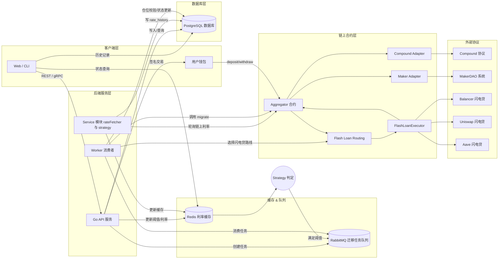
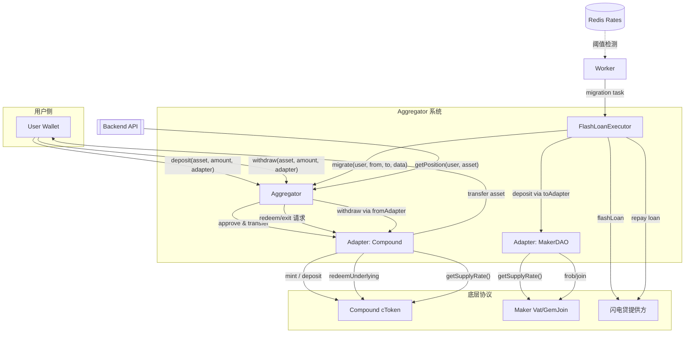

# 合约接口说明（Lending Aggregator）

> 适用于后端服务、脚本工具或前端在与链上聚合器交互时快速查阅。接口均基于 Solidity 0.8.24，兼容 Foundry `abigen` 生成的 Go 绑定。
>
> 更多背景与伪代码请参阅 `docs/lending-aggregator-tutorial.md`，目录布局参考 `docs/project-structure.md`。

---

## 0. 平台架构总览



---

## 1. Aggregator (`IAggregator`)

中央托管合约，负责用户资金管理、协议适配器调用及仓位迁移。

### 1.1 数据结构

```solidity
struct Position {
    address owner;
    address asset;
    uint256 amount;
    address adapter;
}
```

- `owner`：仓位所属用户地址。
- `asset`：基础资产（ERC20）地址。
- `amount`：当前存入数量，单位为 token 原生精度。
- `adapter`：对应的协议适配器地址。

### 1.2 事件

| 事件 | 参数 | 描述 |
|------|------|------|
| `Deposited(address indexed user, address indexed adapter, uint256 amount)` | `user` 调用者；`adapter` 目标协议；`amount` 数量 | 存款成功触发，后端可据此更新仓位表。 |
| `Withdrawn(address indexed user, address indexed adapter, uint256 amount)` | 同上 | 赎回完成。 |
| `Migrated(address indexed user, address fromAdapter, address toAdapter, uint256 amount)` | `fromAdapter` 原协议；`toAdapter` 新协议 | 仓位迁移完成。 |

### 1.3 函数

| 函数 | 目标 | 关键参数 | 使用提示 |
|------|------|----------|---------|
| `deposit(address asset, uint256 amount, address adapter)` | 管理用户入金并调用 Adapter 完成存款 | `asset` ERC20 地址；`amount` > 0；`adapter` 已注册 | 调用前需完成授权；失败通常来自 allowance 不足或 Adapter revert |
| `withdraw(address asset, uint256 amount, address adapter)` | 赎回资产并返还给用户 | `amount` <= 仓位余额；`adapter` 必须匹配仓位记录 | 常用于用户主动赎回或手动迁移；需处理 Adapter 失败场景 |
| `migrate(address user, address fromAdapter, address toAdapter, uint256 amount, bytes data)` | 将仓位从协议 A 迁移到协议 B | `data` 建议 `abi.encode(asset, flashRoute, extra)` | 仅允许 `flashExecutor` 调用；`flashRoute` 为 `NONE` 时需走分步迁移 |
| `getPosition(address user, address asset)` | 查询链上仓位快照 | `user`/`asset` | 后端和 Worker 可据此校验本地数据 |

### 1.4 合约交互流程图



---

## 2. Adapter (`IAdapter`)

协议适配层，封装各协议（Compound、Maker 等）的具体交互。

### 2.1 函数

| 函数 | 目标 | 实现提示 |
|------|------|---------|
| `deposit(address asset, uint256 amount)` | 调用底层协议完成存款 | 仅 Aggregator 调用；需确保授权充足（Compound 走 `mint`，Maker 走 `join/lock`）；失败应直接 revert |
| `withdraw(address asset, uint256 amount, address recipient)` | 赎回资产并转给指定地址 | 限制调用来源以防资产被盗；Compound 推荐 `redeemUnderlying`，Maker 需执行 `free + exit` |
| `getSupplyRate(address asset)` | 返回当前供应利率 | 建议统一单位（BPS 或 Ray），供 rateFetcher 周期刷新 |
| `getProtocolName()` | 标识协议名称 | 用于 Redis key、后端动态映射，例如 `"COMPOUND"`、`"MAKER"` |

---

## 3. 闪电贷执行器 (`FlashLoanExecutor`)

负责串联闪电贷借款、Aggregator 迁移、闪电贷偿还。

### 3.1 核心入口

| 函数 | 目标 | 关键步骤 | 失败处理 |
|------|------|----------|---------|
| `executeMigration(address user, address asset, uint256 amount, bytes data)` | 在闪电贷回调中驱动整笔迁移 | ① 借入资产；② 解码 `flashRoute` 并调用 `Aggregator.migrate`；③ 将资金存入目标协议；④ 偿还本金和费用 | 任一步骤失败需 revert，由链下 Worker 选择其他路线 |

### 3.2 附加接口建议

为方便多协议闪电贷接入，可定义统一提供者接口（示例）：

```solidity
interface IFlashLoanProvider {
    function flashLoan(
        address receiver,
        address asset,
        uint256 amount,
        bytes calldata params
    ) external;
}
```

### 3.3 闪电贷路由与回退

- **Routing 目标**：聚合 Balancer、Uniswap V3、Aave 等多家提供方，选择费用最低、流动性充足的闪电贷来源。
- **链上处理**：
  - `Aggregator.migrate` 接收 `flashRoute`，由 FlashLoanExecutor 判断 `provider`。
  - `FlashLoanExecutor` 根据 `provider` 分发到对应的 `IFlashLoanProvider` 实现。
- **链下协调**：
  - Worker/策略模块预先收集各提供方的费用、可用额度，写入 Redis 或数据库。
  - 生成迁移任务时选出最佳路线；若没有合适路线，将 `provider` 设为 `NONE`，提醒执行器走分步迁移。
- **回退逻辑**：当闪电贷调用失败或提供方流动性不足时，执行器需要：
  1. 回滚当前交易（revert），由 Worker 重试其它路线；或
  2. 采用多笔交易完成迁移（先赎回再存入）。
- **安全要点**：对每个 `provider` 的调用使用 try/catch 捕获错误；对费用与滑点进行链上校验，防止错误路由导致亏损。

---

## 4. 测试辅助合约

在 Foundry 测试中使用的 mock，生产不部署。

### 4.1 `MockERC20`

- `mint(address to, uint256 amount)`：测试环境铸币。
- 继承自 `Solmate` 的 `ERC20`，兼容 Foundry。

### 4.2 `MockOracle`

- `setRate(uint256 _rate)`：设置模拟利率。
- `getRate(address)`：读取设定值。

---

## 5. 交互建议

- **ABI 生成**：使用 `forge inspect <Contract> abi` 或 `abigen` 生成 Go 绑定。
- **交易参数**：统一使用 18 位精度的资产时注意转换；Maker 可能存在不同 `dec`。
- **安全校验**：
  - 确保后端仅对注册 Adapter 发起调用。
  - 在调用 `migrate` 前校验 Redis/DB 与链上仓位一致。
- **事件监听**：
  - 定期抓取 `Deposited`/`Withdrawn`/`Migrated` 用于对账。
  - 可使用 `eth_getLogs` 或 `ethers.js`/`go-ethereum` 订阅。

---
## 6. Compound 协议接口参考

> 以下基于 Compound V2 主网合约。若部署于 L2 或测试网，请替换对应地址。建议在 Adapter 中使用常量或配置文件维护。

### 6.1 关键合约与地址

| 合约             | 功能             | 主网地址 (示例)                                    |
| -------------- | -------------- | -------------------------------------------- |
| `Comptroller`  | 市场风险控制、COMP 激励 | `0x3d9819210A31b4961b30EF54bE2aeD79B9c9Cd3B` |
| `cDAI`         | DAI 供应市场       | `0x5d3a536E4D6DbD6114cc1Ead35777bAB948E3643` |
| `cUSDC`        | USDC 供应市场      | `0x39AA39c021dfbaE8faC545936693aC917d5E7563` |
| `cETH`         | ETH 供应市场 (原生)  | `0x4DdC2D193948926d02f9B1fE9e1daa0718270ED5` |
| `CompoundLens` | 读接口聚合器         | `0xd513d22422a3062Bd342Ae374b4ba1b7518B7f6c` |

### 6.2 cToken 接口详解

#### `mint(uint256 mintAmount)`
- **用途**：存入 `mintAmount` 单位的基础资产，按当前汇率获得 cToken。
- **调用步骤**：
  1. `ERC20(asset).approve(cToken, mintAmount)`。
  2. `cToken.mint(mintAmount)` → 返回 `uint err`。
- **错误处理**：`require(err == 0, "COMPOUND_MINT_FAILED")`。
- **备注**：对于 `cETH`，函数签名为 `mint()`，需随交易携带 `msg.value`。

#### `redeem(uint256 redeemTokens)` / `redeemUnderlying(uint256 redeemUnderlying)`
- **用途**：赎回对应数量的 cToken 或基础资产。
- **区别**：
  - `redeem` 输入 cToken 数量。
  - `redeemUnderlying` 输入基础资产数量，内部自动换算。
- **建议**：Adapter 若以基础资产计量仓位，优先使用 `redeemUnderlying`，避免汇率偏差。

#### `exchangeRateCurrent()` 与 `exchangeRateStored()`
- **结果单位**：`1e18`。
- **用途**：
  - `exchangeRateCurrent` 会触发利息累计，适合链上实时更新。
  - `exchangeRateStored` 不修改状态，适合估算或 off-chain 读取。
- **换算**：基础资产余额 = `cTokenBalance * exchangeRate / 1e18`。

#### `supplyRatePerBlock()`
- **返回**：每个区块的供应利率，单位 `1e18`。
- **年化**：`apr = rate * blocksPerYear`，`blocksPerYear ≈ 4_377_000`（以太坊主网）。

#### `balanceOf(address account)` / `borrowBalanceStored(address account)`
- **用途**：仓位监控，`balanceOf` 返回 cToken 余额。
- **Adapter 中**：可用于 double-check Aggregator 中记录的份额是否一致。

### 6.3 Comptroller 相关接口

#### `enterMarkets(address[] calldata cTokens)`
- **功能**：允许账户将特定市场的抵押用于借贷。
- **在纯供应场景**：可选调用；若未来支持抵押借贷，应在 Adapter 初始化阶段执行一次。

#### `claimComp(address holder)`
- **用途**：领取 COMP 激励。
- **策略**：可在收益策略中按周或按阈值触发，累积奖励后统一处置。

#### `markets(address cToken)`
- **返回**：`(bool isListed, uint collateralFactorMantissa, bool isComped)`。
- **用途**：在构建策略或风控时，校验市场是否启用以及抵押因子。

### 6.4 CompoundLens 读接口

- `cTokenBalances(address cToken, address account)`：一次返回余额、兑换率、基础资产余额等。
- `cTokenUnderlyingPrice(address cToken)`：返回基础资产价格（通过 Oracle）。
- **RateFetcher 中**：
  - 先调用 `supplyRatePerBlock` 取利率。
  - 可结合 `cTokenUnderlyingPrice` 计算美元年化收益。

### 6.5 Adapter 开发建议

1. **状态存储**：记录 `cToken` 地址以及 `asset` 地址，便于在 `deposit/withdraw` 中引用。
2. **错误码映射**：Compound 的 `Error` 枚举可在文档中查阅，对常见错误进行 `require` 处理。
3. **Gas 优化**：
  - 避免重复 `approve`，可在部署时设置无限授权。
  - 对 `exchangeRateCurrent` 的调用应视情况避免频繁触发。
4. **测试**：
  - 使用 Foundry fork 主网，验证 `mint/redeem` 全流程。
  - 模拟利率变化，可通过修改区块高度或 `anvil_setNextBlockBaseFeePerGas` 等手段。

---

## 7. MakerDAO 协议接口参考

> 以 `ETH-A` 仓位为例说明 Maker 核心调用流程。其他抵押品（`USDC-A`, `WBTC-A`, `stETH-A` 等）在地址和参数上有所不同。

### 7.1 核心合约与地址

| 合约 | 功能 | 主网地址 |
|------|------|----------|
| `Vat` | 全局账本，记录抵押与债务 | `0x35D1b3F3D7966A1DFe207aa4514C12a259A0492B` |
| `GemJoin` (`ETH-A`) | WETH 抵押入口 | `0x2F0b23f53734252Bda2277357e97e1517d6B042A` |
| `DaiJoin` | DAI 核心账户入口 | `0x9759A6Ac90977b93B58547b4A71c78317f391A28` |
| `Jug` | 稳定费累积 | `0x19c0976f590D67707E62397C87829d896Dc0f1F1` |
| `Spot` | 价格模块，维护抵押系数 | `0x65C79FCB50Ca1594b025960e539eD7A9a2eC2b7f` |
| `DSProxyFactory` | 创建 DSProxy | `0xA26e15C895EFc0616177B7c1e7270A4C7D51C997` |

### 7.2 Maker 核心数据结构

- `ilk`：抵押品类型，`bytes32`。示例：`bytes32("ETH-A")`。
- `urn`：仓位标识，通常为 `DSProxy` 地址。
- `ink`：抵押数量（RAY，`1e27`）。
- `art`：债务数量（WAD，`1e18`）。
- `rate`：`Vat.ilks(ilk)` 返回的累积费率（RAY）。

### 7.3 存款流程（增加抵押）

1. **将 WETH 授权给 `GemJoin`**：
  ```solidity
  IERC20(weth).approve(gemJoin, amount);
  ```
2. **调用 `GemJoin.join(urn, amount)`**：
  - 将外部 WETH 转入 Maker 系统。
  - `urn` 为目标仓位地址（可为 Adapter 本身或 DSProxy）。
3. **调用 `Vat.frob(ilk, urn, urn, urn, int(dink), 0)`**：
  - `dink = int(amountScaled)`（转换为 18 位或 RAY 单位）。
  - `dart = 0`（不借出 DAI）。
4. **（可选）调用 `Jug.drip(ilk)`**：
  - 确保稳定费数据更新，尤其在计算利率时。

### 7.4 赎回流程（减少抵押）

1. **调用 `Vat.frob(ilk, urn, urn, urn, -int(dink), -int(dart))`**：
  - 若无负债，则 `dart = 0`。
  - 保证仓位安全：`ink` 不得减至负值。
2. **调用 `GemJoin.exit(recipient, amount)`**：
  - 将抵押资产从 Maker 取出。
3. **若存在 DAI 债务**：
  - 需要先使用 `DaiJoin.join(urn, wad)` 将 DAI 转回 Maker，再 `frob` 归还债务。

### 7.5 利率与价格接口

- `Jug.drip(bytes32 ilk)`：累积稳定费，更新 `Vat.ilks` 中的 `rate`。
- `Vat.ilks(bytes32 ilk)`：返回 `(Art, rate, spot, line, dust)`。
- **稳定费计算**：
  - `rate` 是累积值，初始 `1e27`。
  - 年化稳定费 ≈ `(rate - RAY) * secondsPerYear / secondsSinceLastDrip`。
- **价格**：
  - `Spotter.ilks(ilk)` 返回 `pip`（oracle）和 `mat`（抵押比率）。
  - 结合 `Vat.ilks(ilk).spot` 得到最大可借额度。

### 7.6 Adapter 开发要点

1. **权限管理**：
  - 若 Adapter 直接与 Vat 交互，需要调用 `Vat.hope(address)` 授权自身或 Aggregator。
  - 推荐为每个资产部署一个 `DSProxy`，由 Aggregator 控制，以便调用复杂操作 (`frob`, `flux`, `move`)。
2. **单位转换**：
  - Maker 使用多种精度：`WAD` (`1e18`), `RAY` (`1e27`), `RAD` (`1e45`)。
  - 例如 `dink` 需要转换为 18 位精度，再根据 `GemJoin.dec()` 调整。
3. **错误捕获**：
  - Maker revert 信息多为字符串（如 `Vat/not-allowed`），Adapter 应统一转换为易读错误。
4. **测试策略**：
  - Foundry fork 环境中，需提前为 `DSProxy` 提供足额 WETH、DAI。
  - 可利用 Maker 测试合约（`dss-test`）快速搭建本地环境。

### 7.7 Go 端集成提示

- **ABI**：
  - 从 Maker 官方仓库或使用 `forge inspect` 生成 `Vat`, `GemJoin`, `DaiJoin`, `Jug` ABI。
- **调用顺序**：
  - 使用 `bind.TransactOpts` 调用写函数，确保 Gas 限制足够高。
  - 对于 `frob` 等多参数函数，建议在 Go 侧封装 helper，提高可读性。
- **监控**：
  - 订阅 `LogNote` 事件（Maker 标准日志），可追踪 `frob`, `fork`, `grab` 等关键操作。

---

## 8. 后续扩展建议

- 为每个协议维护独立配置文件（JSON/YAML），包含合约地址、精度、利率采集方法。
- 编写 `docs/adapters/<protocol>.md` 延伸文档，记录测试步骤、异常处理、常见问题。
- 随项目演进可加入 Aave/Spark/Morpho 的接口说明，保持文档一致性。

---

如需扩展到 Aave/Spark/Morpho，只需确保新 Adapter 遵循 `IAdapter` 接口并在 Aggregator 中注册即可。